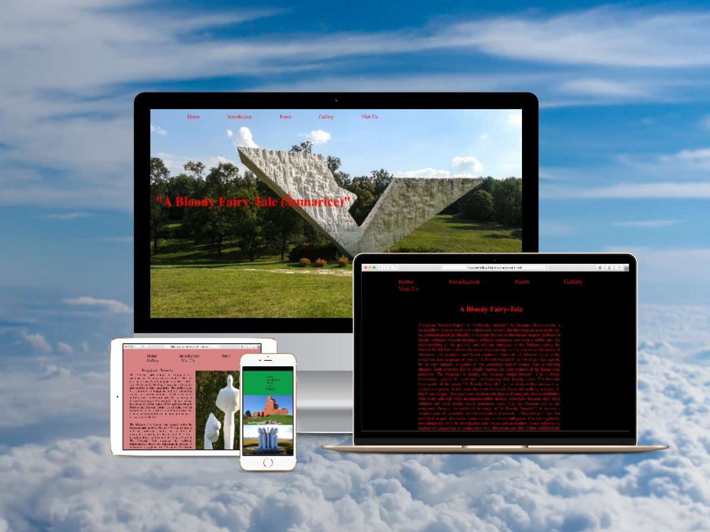
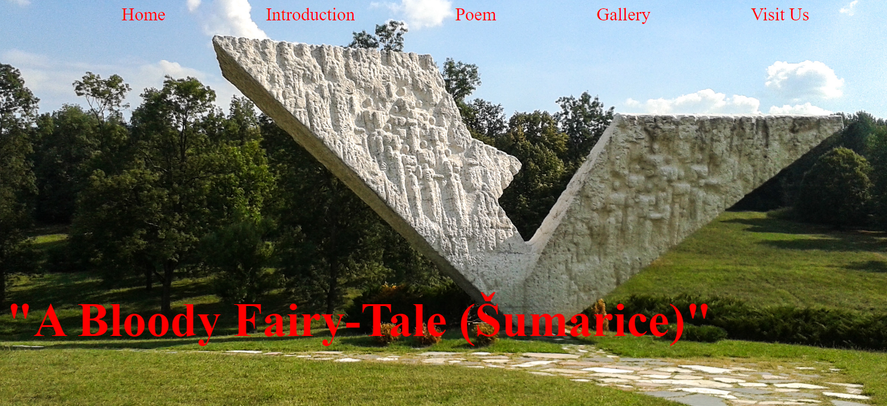
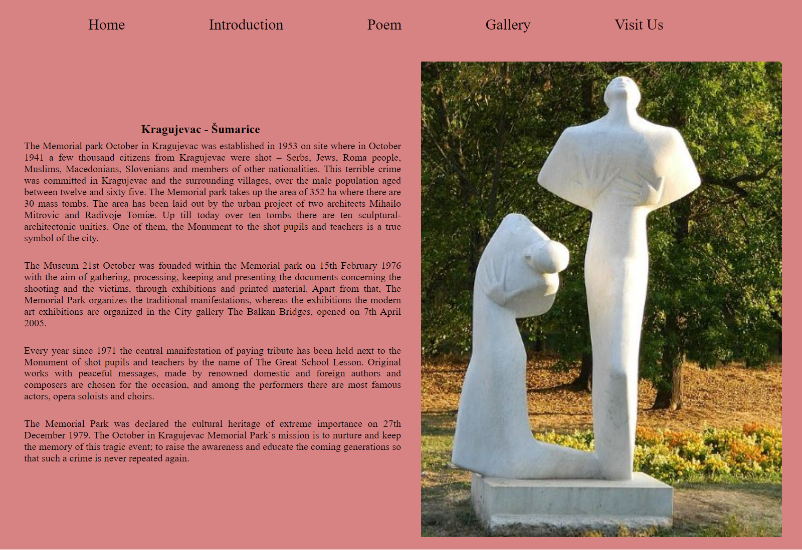
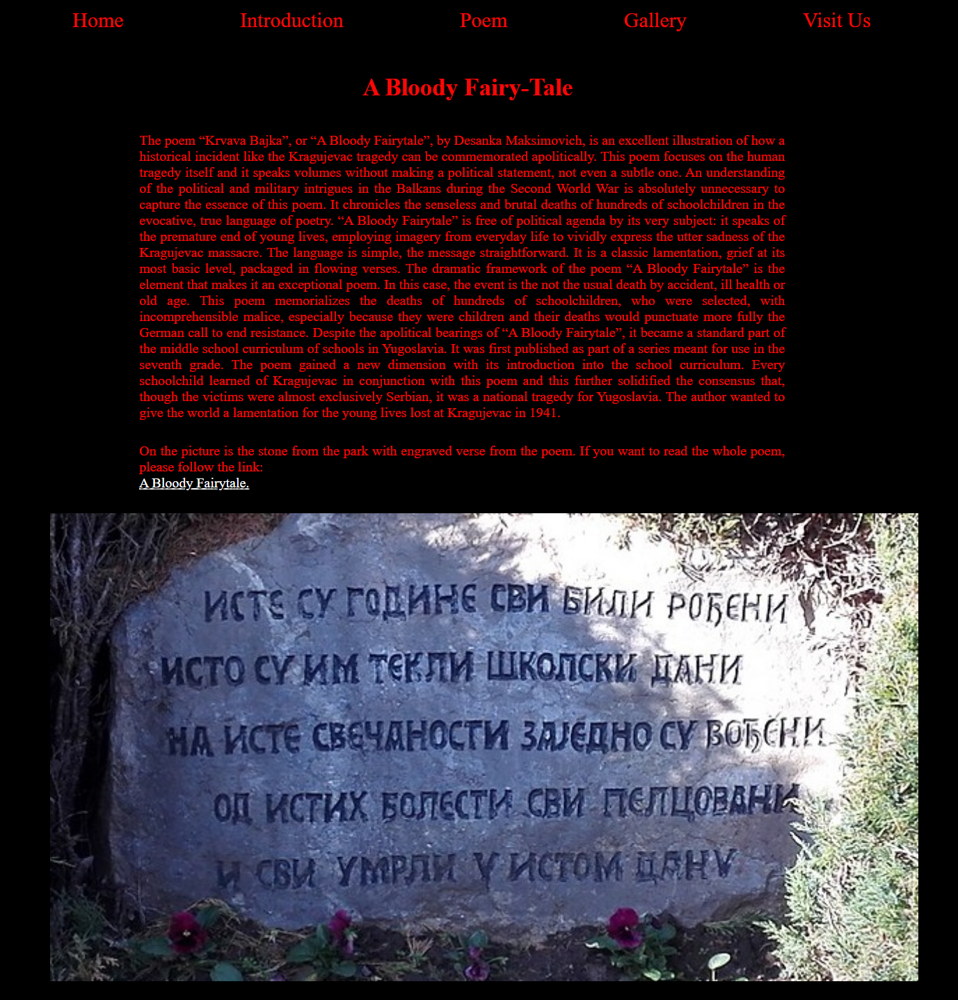
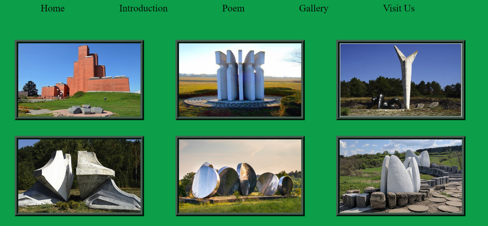
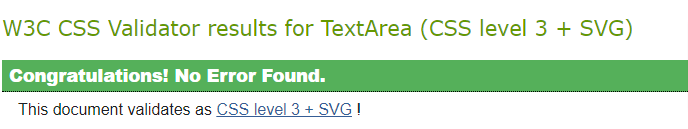
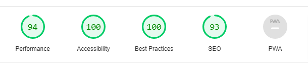

# A Bloody Fairy-Tale 

This is my first project and it is dedicated to myself (10 years of war zone) but also to current war in Ukraine. The idea behind the project is to remind all of us that war brings nothing good and that we as human kind are all fragile and temporarily on the planet. The approach to idea was to be presented in the style of the book ("fairytale") like parents read to children. Each page is different and has a symbol behind it. 

## Existing Features

* Navigation Bar
      
      * Featured on all five pages the full responsive navigation bar includes links to Home page, Introduction, Poem, Gallery and Visit Us page and each page is different to wake up the curiosity of the reader what follows next.
  
      * This section will alow the user to easily navigate from page to page across all devices without having to revert to the previous page via the "back" button.
   
  

* The Landing Page Image 

      * The landing page includes a photograph with title.
   
      * The title is written in red color to attract the user attention and curiosity.
  
  

* Introduction Page
      
      * The introduction page includes information about the event and the photograph of one the monuments which is representing the past state of mind.
  
      * The background is change to color to allow the user to easily read the content but also to prepare for the next page.

  
  
* The Poem Page 

      * The poem page includes the meaning behind the poem "A Bloody Fairy-Tale" and the picture of the stone with ingraved verse from the poem which children learn today in schools.
  
      * The background color and navigation bar are changed to red as symbol of a tragedy that has happened during World War Two.

   

* The Gallery Page 

       * The gallery page will provide the user with supporting images to see that tragedy which has happened had a huge impact on the town, country and the world.
  
       * The background color is changed to green as the symbol where all the monuments lay in the Memorial Park.

   
   
* The Visit Us Page

       * The visit us page includes the google map with the location and footer with links to the relevant social media sites. At the bottom as part of the footer is link to my Github page.
  
       * This page is valuable to user to find easily the location of the tragedy but also to necessary information for further knowdledge and insite of the events. Each link opens in the new tab so the user can easily navigate between pages. The user can also get more information about my work on this and other projects.

   

## Techology Used 

1. HTML5
2. CSS3
3. Google Chrome developer tools

## Testing

   * I tested that pages work in different browsers: Chrome, Firefox, Safari, Opera.

   * I confirmed that this project is responsive, looks good and function on all standard screen sizes using the devtools device toolbar.

   * I confirmed that the navigation bar, title, introduction and poem texts are all readable and easy to understand.

   * I have confirmed that all the links function and open webpages in the new tab.

## Bugs

### Unsolved bug

    * When I tested pages on smaller screens (under 800px), it showed that navbar is jumping. 

    * I discovered that was caused by the padding added to the navbar.

    * Removing the padding solved the problem but then the navbar was too close to the top of the screen.

## Validator Testing

* HTML

   * All pages are showing one error with the message "The main element must not appear as a descendant of the section element. For validation was used [W3C](https://validator.w3.org)

* CSS

   * No errors were found when passing through the offical [(Jigsaw) validator](https://jigsaw.w3.org/css-validator/)

   
   
* Accessibility 

   * I confirmed that the colours and fonts chosen are easy to read and accessible by running it through lighthouse in devtools

   